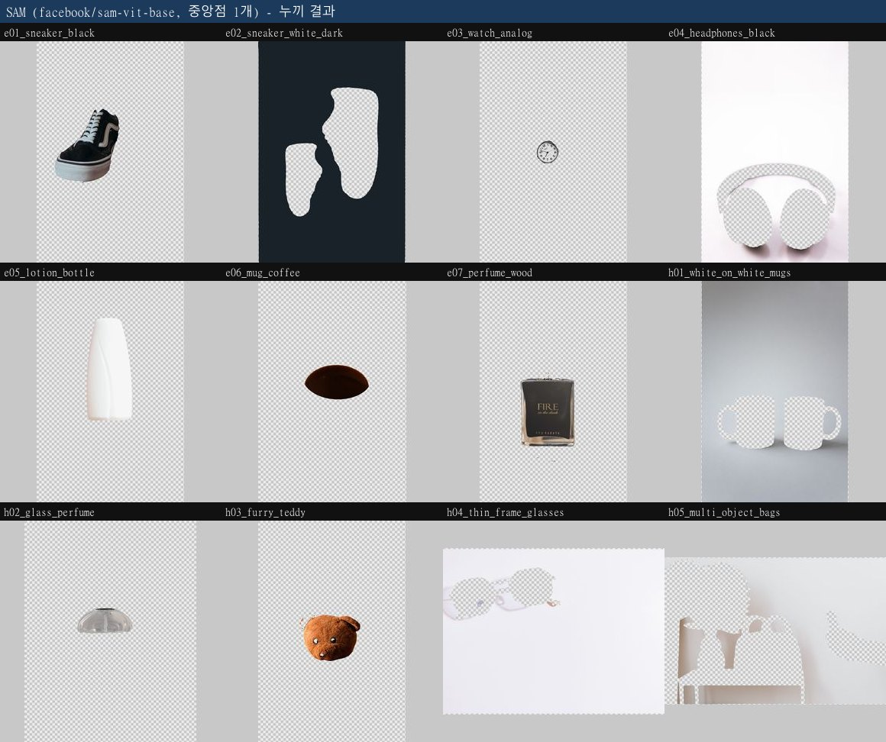
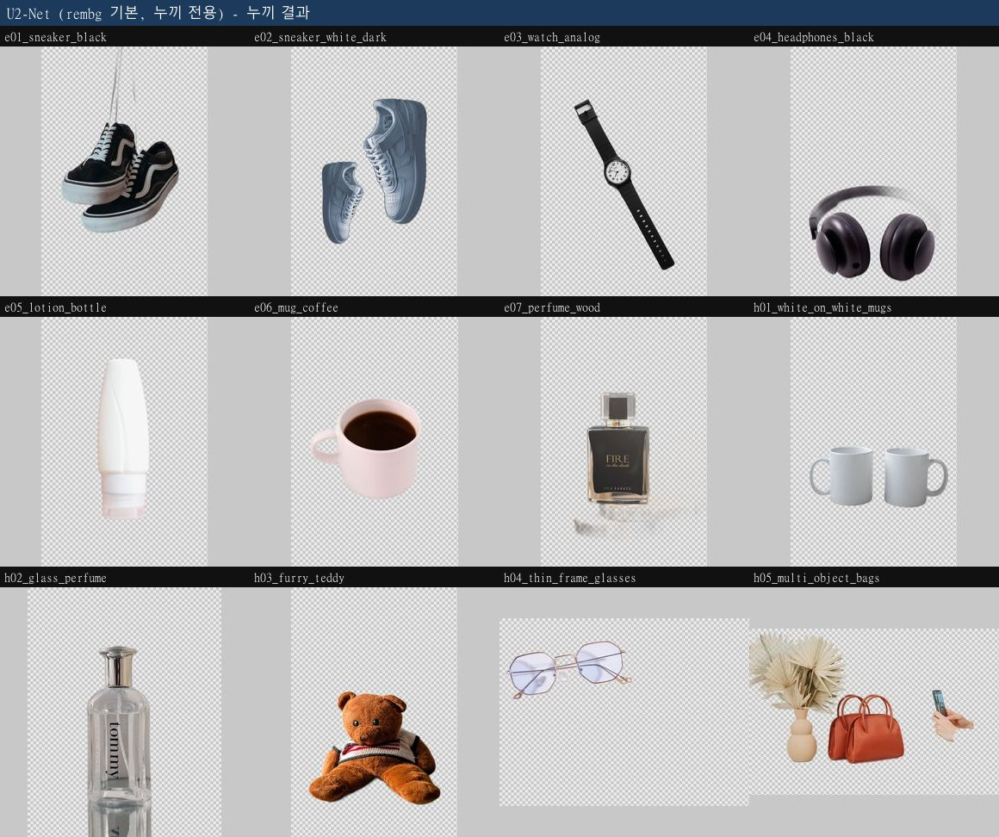
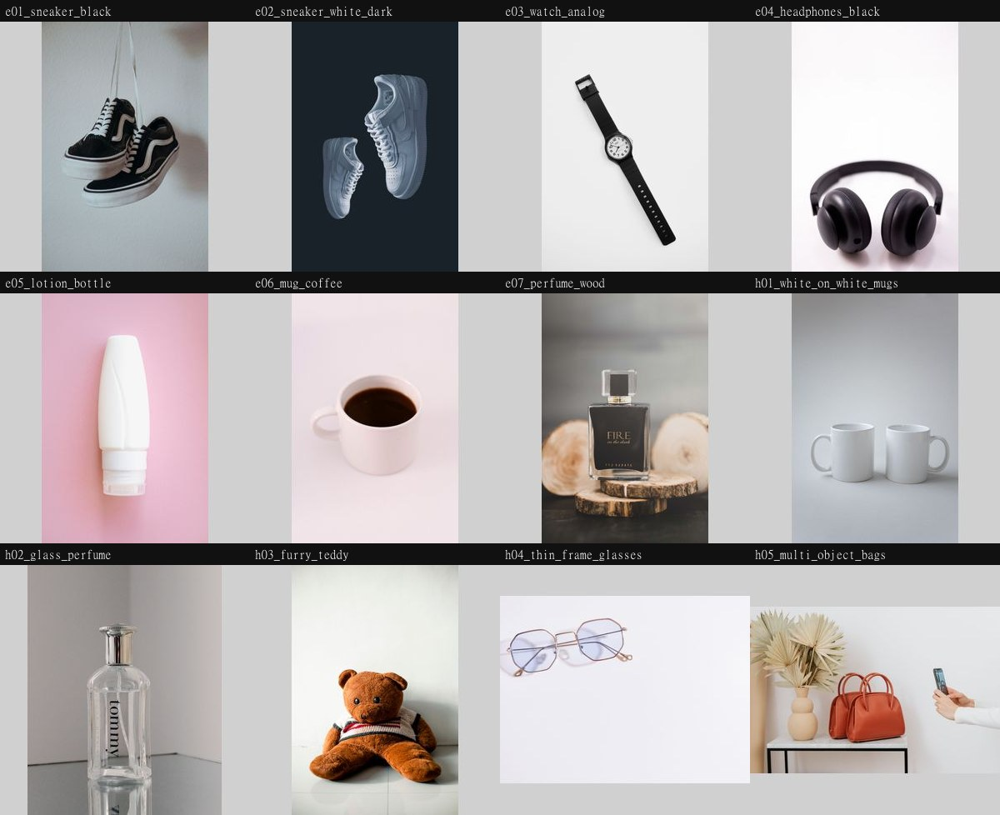

# 이커머스 상품 누끼 자동화 PoC

상품 사진에서 배경을 자동으로 제거하는 작업(**누끼**)에 AI 분할 모델을 넣으면 실제로 나아지는지,
작게 만들어 확인한 PoC입니다.

**결론부터: 성공 기준을 넘지 못했습니다.** 누끼 전용 모델은 12장 중 7장 합격(기준 9장),
범용 모델(SAM)은 0장이었습니다. 다만 **실패할 장을 미리 골라내는 것은 5건 중 4건 가능**했고,
그 사실이 다음 단계를 정합니다. 기준을 못 넘은 이유가 이 PoC의 결과물입니다.

---

## 결과 미리보기

### 후보 1 — SAM (범용 분할 모델 + 중앙점 1개) · 0/12



12장 중 5장에서 **상품이 아니라 배경이 추출**됐습니다. 사진 중앙에 점을 찍었는데 그 자리가
운동화 두 짝 **사이**, 헤드밴드 **아래**, 머그 **사이**, 렌즈 **속**이었기 때문입니다.
SAM은 시킨 대로 그 영역을 정확히 땄고, 그 영역이 배경이었습니다.

### 후보 2 — U²-Net (누끼 전용 모델) · 7/12



흰 배경 위 흰 머그, 얇은 금속테 안경, 머그 손잡이 구멍까지 처리했습니다.
실패 5건은 그림자 잔상·반사·털 뭉개짐·약한 대비·상품 지목 불가입니다.

### 샘플 12장 (쉬운 7 + 어려운 5)



---

## 저장소 구성

| 경로 | 내용 |
|---|---|
| [`docs/01_problem_definition.md`](docs/01_problem_definition.md) | **문제 정의서** — 도메인, 현재 문제, 개선 가설, 대상 사용자, 성공 기준 |
| [`docs/02_model_selection.md`](docs/02_model_selection.md) | **모델 선정 근거** — 후보 구성 원칙, 제외 조건, 라이선스 확인 |
| [`docs/03_verification.md`](docs/03_verification.md) | **검증 결과** — 기준선 비교, 실패 사례 전량, 신뢰도 분석 |
| [`docs/04_limits_next.md`](docs/04_limits_next.md) | **한계와 다음 단계** — 실패 유형별 대응, 도입까지 필요한 것 |
| [`poc/run_cutout.py`](poc/run_cutout.py) | 본체. 후보 모델을 같은 사진에 나란히 돌린다 |
| [`poc/run_all.sh`](poc/run_all.sh) | 후보를 하나씩 별도 프로세스로 실행 (메모리 때문) |
| [`poc/check_env.py`](poc/check_env.py) | 실행 환경과 패키지 라이선스 확인 |
| [`data/samples/`](data/samples/) | 샘플 상품 사진 12장 |
| [`data/SOURCES.md`](data/SOURCES.md) | 이미지 출처·라이선스·확인 날짜 |
| [`data/ground_truth.csv`](data/ground_truth.csv) | **모델을 돌리기 전에** 확정한 정답 |
| [`outputs/run2/scores.csv`](outputs/run2/scores.csv) | 모델이 낸 값 (반올림 없음) |
| [`outputs/run2/scoring.csv`](outputs/run2/scoring.csv) | 사람이 낸 합격/불합격 판정과 실패 사유 |
| [`outputs/run2/config.json`](outputs/run2/config.json) | 실제로 쓴 판정값 전체 |
| `outputs/run2/<모델>/png/` | 배경이 제거된 투명 PNG |
| `outputs/run2/<모델>/check/` | 검산용 이미지 — `원본 \| 마스크 \| 체커보드 합성` |

---

## 실행 방법

### 방법 A — Google Colab (권장)

GPU가 없어도 되고 설치할 것이 없습니다. 이 PoC의 결과도 이 환경(무료 티어 Tesla T4)에서
나왔습니다.

[`notebooks/run_poc_colab.ipynb`](notebooks/run_poc_colab.ipynb)를 Colab에서 열고 위에서부터
실행하면 됩니다. 노트북이 저장소를 내려받고, 패키지를 설치하고, 12장을 처리한 뒤 결과를 보여줍니다.

또는 셀 하나에 붙여넣어도 됩니다.

```python
!git clone https://github.com/songyee-ai/ecommerce-cutout-poc.git
%cd ecommerce-cutout-poc
!pip install -q rembg onnxruntime
!python poc/run_cutout.py --images data/samples --out outputs --backends sam --run-id my_run
!python poc/run_cutout.py --images data/samples --out outputs --backends u2net --run-id my_run
```

> **후보를 한 번에 돌리지 마세요.** `--backends sam,u2net` 처럼 붙여 쓰면 두 모델이 동시에
> 메모리에 올라가 무료 Colab 한도(약 13GB)를 넘기고 프로세스가 강제 종료됩니다.
> 실제로 겪은 문제이고, 그래서 [`poc/run_all.sh`](poc/run_all.sh)가 후보마다 프로세스를 나눕니다.

### 방법 B — 로컬 PC

GPU는 필요 없습니다. CPU로 12장에 1~2분 정도 걸립니다.

```bash
git clone https://github.com/songyee-ai/ecommerce-cutout-poc.git
cd ecommerce-cutout-poc
python -m venv .venv && source .venv/bin/activate   # 윈도우: .venv\Scripts\activate
pip install torch transformers rembg onnxruntime pillow numpy
python poc/run_cutout.py --images data/samples --out outputs --backends u2net --run-id my_run
```

처음 실행할 때 모델 가중치를 내려받습니다 (SAM 375MB, U²-Net 176MB).

### 결과 보는 법

`outputs/<run-id>/<모델>/check/` 안의 이미지를 열어보세요. 한 장에 세 칸이 붙어 있습니다.

```
[ 원본 사진 ] [ 마스크(흰=상품) ] [ 체커보드 위 합성 ]
```

세 번째 칸의 **회색 체크무늬가 투명하게 뚫린 부분**입니다. 숫자만 보면 값이 의도한 것을
재고 있지 않은 경우를 놓치기 때문에, 각도를 계산하기 전에 한 번 그려 보는 것과 같은 검산입니다.

---

## 판정에 쓰는 값은 전부 인자입니다

코드에 숫자를 박지 않았습니다. 실제로 쓴 값은 `outputs/run2/config.json`에 저장돼 있습니다.

```bash
python poc/run_cutout.py --help
```

| 인자 | 뜻 | 기본값 |
|---|---|---|
| `--sam-point` | 상품을 지목하는 방식 (`center` / `center9`) | `center` |
| `--sam-mask-pick` | SAM이 돌려준 후보 마스크 중 무엇을 고를지 | `best_iou` |
| `--sam-mask-threshold` | 마스크 로짓을 이진화하는 경계 | `0.0` |
| `--sam-stability-delta` | 안정도를 잴 때 경계를 흔드는 폭 | `1.0` |
| `--alpha-threshold` | 알파값을 상품/배경으로 가를 경계 | `128` |
| `--edge-band` | 경계 애매도를 잴 때 중간값으로 볼 폭 | `8` |
| `--max-side` | 처리 전 이미지 긴 변 크기 | `1400` |
| `--run-id` | 결과 하위 폴더. 다시 돌려도 이전 결과를 덮어쓰지 않음 | 실행 시각 |

---

## 실행 환경

| 항목 | 값 |
|---|---|
| 하드웨어 | Google Colab 무료 티어, Tesla T4 (VRAM 14.56GB) |
| Python | 3.13.15 |
| torch | 2.11.0+cu128 (BSD-3-Clause) |
| transformers | 5.16.1 (Apache 2.0) |
| rembg | 2.0.85 (MIT) |
| onnxruntime | 1.30.0 (MIT) |

모델 가중치 라이선스 (2026-09-22 확인):
`facebook/sam-vit-base` Apache 2.0 · U²-Net Apache 2.0 · BiRefNet MIT — 전부 상업 사용 가능.

샘플 이미지는 Pexels License (상업 사용 가능, 출처 표기 의무 없음). 출처 목록은
[`data/SOURCES.md`](data/SOURCES.md)에 있습니다.

---

## 데모 URL

배포하지 않았습니다. PoC의 목적은 쓰이는 것이 아니라 판단이 서는 것이라, 화면 완성도에
시간을 쓰지 않았습니다.
